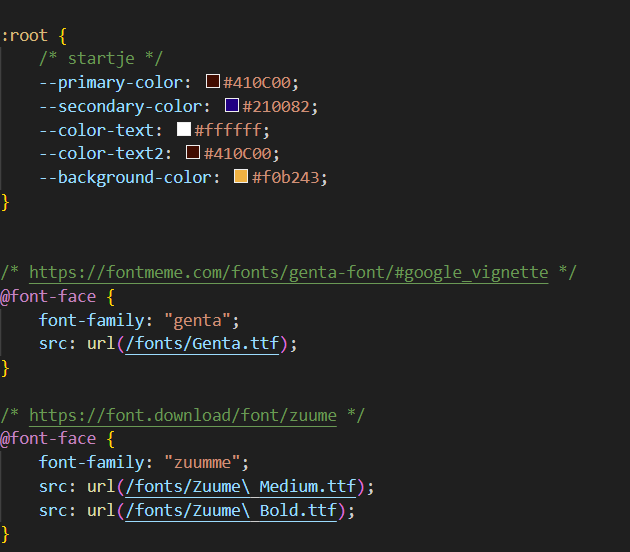
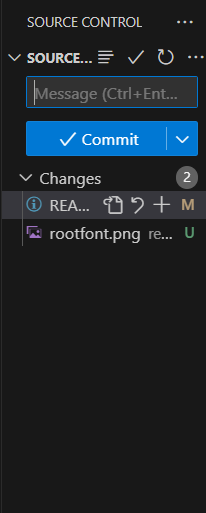
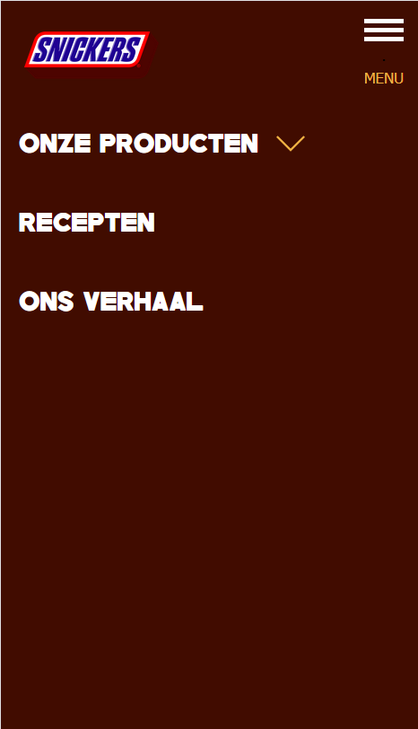
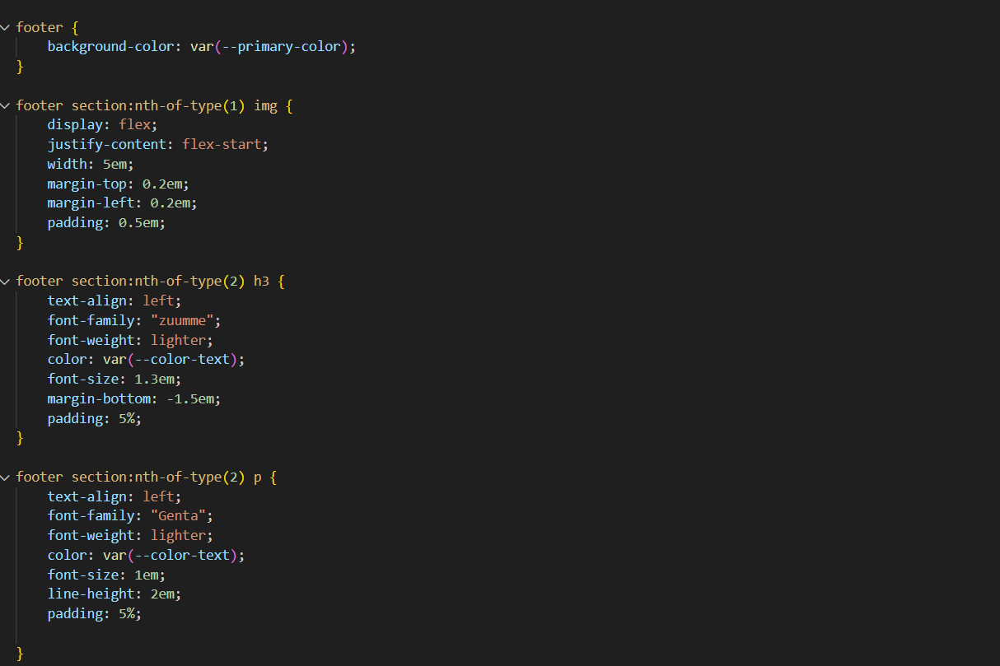

# Procesverslag
Markdown is een simpele manier om HTML te schrijven.  
Markdown cheat cheet: [Hulp bij het schrijven van Markdown](https://github.com/adam-p/markdown-here/wiki/Markdown-Cheatsheet).

Nb. De standaardstructuur en de spartaanse opmaak van de README.md zijn helemaal prima. Het gaat om de inhoud van je procesverslag. Besteedt de tijd voor pracht en praal aan je website.

Nb. Door *open* toe te voegen aan een *details* element kun je deze standaard open zetten. Fijn om dat steeds voor de relevante stuk(ken) te doen.

## Jij

  
uitwerken voor kick-off werkgroep

  ### Auteur: 
  Naoufal Haddouzi
  #### Je startniveau: 
  Blauw

  #### Je focus: 
  Surface Plane
 

## Je website

  
uitwerken voor kick-off werkgroep

  ### Je opdracht: 

  link naar de website die je gaat namaken óf de naam/omschrijving van je eigen ontwerp

  https://www.snickers.nl/

  #### Screenshot(s) van de eerste pagina (small screen): 
  Home Pagina

  

  #### Screenshot(s) van de tweede pagina (small screen):
  Stukje Geschiedenis Pagina

  
 

## Toegankelijkheidstest 1/2 (week 1)

  
uitwerken na test in 2e werkgroep

  ### Bevindingen
  Lijst met je bevindingen die in de test naar voren kwamen:

  - H2 element boven de H1 element
  - Website gebruikt geen complexe afbeeldingen
  - Videos kunnen gestopt worden in de website zelf
  - Geen darkmode support
  - Sommige afbeeldingen bewegen een kleinbeetje
  - Elke afbeelding heeft een ALT tekst
  - Perfecte kleuren contrast

## Breakdownschets (week 1)

  
uitwerken na afloop 3e werkgroep

  ### de hele pagina: 

  Een logo rechts boven met een dropdown menu aan de zijkant, vervolgens een advertentie er onder, waar ook nog een button is om door te gaan naar een andere scherm. Ook nog alle verschillende Snickers die worden verkocht op dit moment.

  

  Meer advertenties en een footer met algemene informatie

  

  ### dynamisch deel: 

  Als het scherm een telefoon is, zal de navigatie bar een dropdown menu worden.

  

  ### wellicht nog een dynamisch deel: 

  Afbeelding beweegt en de button highlight wanneer er op wordt gehoverd, met een kleine pauze. Ook zit er een video in.

  

## Voortgang 1 (week 2)

  
uitwerken voor 1e voortgang

  ### Stand van zaken

  Ik heb begonnen met alle content in mijn code te zetten. De tekst-inhoud was wel vanzelfsprekend. Wel waren sommmige headers niet logisch ingedeelt (dit staat ook in mijn bevindingen), dus ik heb besproken met de docent en gekeken wat nu het beste optie zou zijn qua headers.
  
Screenshots van nieuwe headers en tekst:

 

  Bij de afbeeldingen heb ik een nieuwe mapje gemaakt genaamd "images". Toch ging het mis met een paar afbeeldingen die ik direct uit de website heb gehaald. Soms waren ze niet compleet dus er misten een stukje of het moment dat het maar 1px was en helemaal niet kon gebruiken. Dit kwam blijkbaar door dat sommige afbeeldingen vast zaten in hun eigen database. Ik heb toen gezocht naar andere afbeeldingen die ik kon gebruiken.

Screenshots van afbeeldingen en foute pogingen:

 
 

  Er zat ook een video in mijn gekozen website. Dit viel wel mee op uiteindelijk in mijn code te zetten alleen moest ik gebruik maken van de "video" tag. 

   ### Agenda voor meeting

  Geen agenda gemaakt 

  ### Verslag van meeting
  hier na afloop snel de uitkomsten van de meeting vastleggen

  - In mijn website was de H1 niet helemaal logisch dus ik had nagevraagd wat ik de H1 zou maken. Ik kreeg te horen dat de logo het beste is om H1 te maken. Dus ik heb dat aangepast.
  - Bespreken of een hamburger menu handig is in mijn site. Uiteindelijk zijn we daar voor gegaan.
  - Ik had een section zonder header dus ik kreeg een "info" op mijn html van we w3school validation. Dit moet ik gaan aanpassen omdat de screenreader het ook niet lezen.
  - Taal van Engels naar Nederlands omdat alle content in het Nederlands is. Dit helpt ook met de screenreader.

## Voortgang 2 (week 3)

  
uitwerken voor 2e voortgang

  ### Stand van zaken

  Ik ben begonnen met het maken van een header en footer en het alvast creeren van mijn tweede pagina. 

  Tijdens het creeren van mijn footer en header heb ik gemerkt dat ze allebij niet tegen de zijkanten kwamen. Douwe heeft me gelukkig daarbij geholpen en het lag aan dat de universal selector niet de padding en margin op "0" had. Sommige browsers zijn daar vervelend mij inclusief Firefox. 

  Ik ben begonnen met het opstellen van mijn css. Ik heb een Root gemaakt. Dit eigenlijk gewoon een stylesheet waar je verschillende kleuren, font-sizes etc al kan maken en dan gemakkelijk kan toevoegen op andere elementen. Ik had hier een beetje moeite mee omdat ik steeds in de war raakten met welke namen ik heb gebruikt. 

  Over namen gesproken, ik kreeg een goede tip van Anouk dat ik de namen van mijn images moest veranderen. Ik had overal een hoofdletter bij het begin en dit maakt niet perse uit maar het maakt het wel makkelijker als je die regel zelf voor je zet. Ook heb ik met de hulp van Anouk de fonts erin kunnen krijgen met @font-face. 

  
  
  Ik ben ook wat meer gaan focussen op flexbox en wat het allemaal inhoud. Ik heb Flexbox Froggy gespeeld en heb wat kennis opgedaan. Ik kon op een paar afbeeldingen in mijn website op de goede plek krijgen. 

  Iets kleins was ook dat ik met de hulp van Levon mijn VSC en Github heb kunnen linken. Dus nu als ik wat verander in VSC kan ik het gelijk pushen naar Github zonder de heletijd te kopieren en plakken. 

  

  ### Agenda voor meeting

  Geen agenda gemaakt 
  
  ### Vragen voor meeting

  - Meer uitleg over nth-of-type en hoe dat zou werken met mijn tweede pagina.
  - Confirmatie over wat er nu allemaal in moet komen als je Surface Plane hebt gekozen.
  - Of de headings goed en logisch staan.

  ### Verslag van meeting
  hier na afloop snel de uitkomsten van de meeting vastleggen

  - 

## Toegankelijkheidstest 2/2 (week 4)

  
uitwerken na test in 9e werkgroep

  ### Bevindingen
  Lijst met je bevindingen die in de test naar voren kwamen (geef ook aan wat er verbeterd is):

  - De website heeft een combinatie van Nederlandse maar ook Engels woorden. Dus de screenreader leest het raar op.

## Voortgang 3 (week 4)

  
uitwerken voor 3e voortgang

  ### Stand van zaken
  Ik heb met Ali (de studenten assistent) gezeten aan een paar problemen opgelost.

  Ik kreeg mijn hamburgermenu niet aan de praat. Ik kreeg de lijntjes die ik had niet goed recht dus Ali heeft me daarbij geholpen. Hij heeft me gelijk geholpen met het opstellen van de Javascript. 

  

  Verder ben ik geholpen met het goed zetten van mijn sections. Het was eerst nog een beetje slordig en vooral toen ik ze allemaal begon te stylen.

  Ook heeft Ali een suggestie gedaan om al mijn afbeeldingen in een ul en li te zetten. 

  Ik heb ook hulp gekregen met goed zetten van mijn tekst in een afbeelding en video. Ali deed de voorstel om grid te gebruiken alleen begrijp ik het nogsteeds niet heel goed. Ook zei hij dat het slimmer was om de afbeelding/video wat donkerder te maken zodat het beter leesbaar zou zijn met de witte tekst. 

  Mijn css was nog heel slordig dus ik heb het ook even opgemaakt.

   

  Ook heb ik bij elke button een "cursor pointer toegevoegd".

  ### Vragen voor meeting

  - Hoe ik de tweede pagina het best kan stylen
  - Is mijn bron vermelding duidelijk genoeg
  - Inspiratie voor meer Surface plane elementen

  ### Verslag van meeting
  hier na afloop snel de uitkomsten van de meeting vastleggen

  - punt 1
  - punt 2
  - nog een punt
  - ...

## Eindgesprek (week 5)

  
uitwerken voor eindgesprek

  ### Je uitkomst - karakteristiek screenshots:
  

  ### Dit ging goed/Heb ik geleerd: 
  Korte omschrijving met plaatjes

  

  ### Dit was lastig/Is niet gelukt:
  Korte omschrijving met plaatjes

  

### Nog te doen voor de herkansing
- maak een formulier (op teams) (Gedaan)
- Maak een animatie voor de hamburgermenu (Gedaan)
- Alles checken voor hoofdletters en anders stylen (Gedaan)
- Span in lang=en zetten bij engels woorden (Gedaan)
- Wcag formulier maken (Gedaan)
- Netjes houden (Gedaan)
- Meer surface plane dingen (Gedaan)
- Read me goed bijhouden

## Herkansing

## Bronnenlijst

  
continu bijhouden terwijl je werkt

  Nb. Wees specifiek ('css-tricks' als bron is bijv. niet specifiek genoeg). 
  Nb. ChatGpT en andere AI horen er ook bij.
  Nb. Vermeld de bronnen ook in je code.

  1. Alle afbeeldingen en content zijn van de Snickers Website: https://www.snickers.nl/ en 
  2. Hoe een Video tag werkt heb ik van w3schools Website: https://www.w3schools.com/tags/tag_video.asp
  3. Navigatie Balk/Hamburger menu hulp gekregen van de studenten assistent.
  4. Er in zetten van de font met @font-face heb ik hulp gekregen van Anouk.
  5. Extra Grid uitleg en tekst krijgen in afbeeldingen/videos van (De studenten assistent)
  6. Aria-Labels door ChatGPT: https://chatgpt.com/share/675ac6bc-9e20-8005-82f3-cc06e14c716d
  

